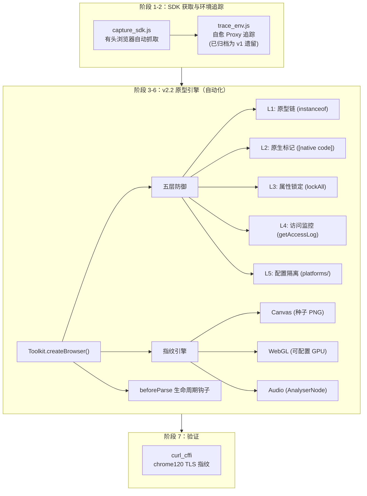
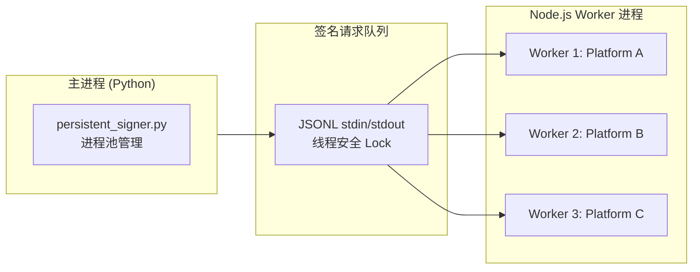
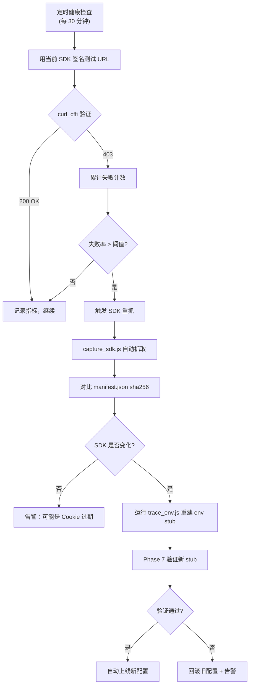

# fast-spider-skills-kit · 快蛛补环境工具箱

[](LICENSE)
[](https://nodejs.org)
[](https://python.org)

> **面向国内爬虫逆向工程师的工业级补环境框架。** 在 Node.js `vm` 沙箱中构建高仿真浏览器环境，将目标站点原样的 JSVMP / 混淆加签 SDK 直接离线执行，产出有效签名——全程无需 Headless Browser。

### 你面临的问题 → 本框架的解法

| 场景 | 传统方案痛点 | 本框架解法 |
|------|-------------|-----------|
| JSVMP 签名 SDK 无法纯算还原 | 手动补环境 3-5 轮，每轮改几十个属性 | **五层防御体系** + 原型链自动构造，一次配置永久复用 |
| SDK 隔周更新，签名失效 | 重抓 SDK → 重写 `sign_xxx.js` → 调试 | **平台化配置**：新增目标只需复制 JSON 模板，不改核心代码 |
| 多站点同时维护 | 每个站点维护一套独立脚本，改一处漏十处 | **统一 Toolkit 入口**：`createBrowser({ platform: '<name>' })` 一招通吃 |
| Canvas/WebGL/Audio 指纹被风控识别 | 硬编码固定值，多次调用完全一致 | **种子确定性随机化**：同种子同指纹，异种子异指纹，消除固定特征 |
| 签名 403 查不出原因 | 猜测式调试，改代码→重跑→再猜 | **`document.all` 监控**：精确记录 SDK 触碰的每个浏览器属性 + 调用栈 |

> **声明**：本仓库提供通用方法论与模板代码，不包含任何第三方站点的加签 SDK 或敏感数据。仅供合法授权测试使用；禁止用于未授权的爬取或绕过保护措施。

### 导航

| 你想做什么 | 跳转 |
|-----------|------|
| 了解整体架构与核心概念 | [架构总览](#架构总览) |
| 快速上手，跑通第一个签名 | [快速开始](#快速开始) |
| 接入新站点（平台开发） | [平台开发指南](#平台开发指南) |
| 排查签名 403 / 风控拦截 | [实战排错](#实战排错) |
| 处理高并发 + SDK 轮换 | [实战场景](#实战场景) |
| 避免常见翻车操作 | [避坑指南](#避坑指南) |

## Quick Start

```bash
git clone https://github.com/alei-xi/fast-spider-skills-kit.git
cd fast-spider-skills-kit

# 0. 安装 Playwright 浏览器（仅首次）
npx playwright install chromium

# 1. 自动抓取 + 自动搭建环境（两步即可出签名）
node core/capture_sdk.js --url "https://www.<target>.com/"
node core/trace_env.js bundles/signer.js > bundles/fake_env.js

# 2. 编写 sign.js 加载 fake_env.js + 你的 SDK，启动签名服务

# 3. 从 Python 调用
pip install curl_cffi
python core/persistent_signer.py
```

## 架构总览



本框架的核心思路：**不在最终爬虫中跑浏览器**。浏览器仅用于阶段 1（抓 SDK）和阶段 7（验证签名）。阶段 2-6 全部在 Node.js `vm` 沙箱中离线完成，单次签名耗时 < 20ms。

## 前置依赖

| 组件 | 版本要求 | 用途 |
|------|----------|------|
| Node.js | >= 18 | 运行 `vm` 沙箱、JS 模板 |
| Playwright | latest | `capture_sdk.js` 自动抓取 SDK |
| Python | >= 3.10 | `persistent_signer.py` 子进程管理 |
| curl_cffi | latest | 端到端验证时的 TLS 指纹模拟 |

## 决策树：纯算法复现 vs 补环境

```
签名 SDK 是否为 JSVMP / 重度虚拟化？
├── 否，普通压缩 JS
│   ├── < 5 KB → 直接翻译到 Python
│   └── 5-50 KB → 纯算法翻译，几天内交付
└── 是，JSVMP / 栈式虚拟机解释器模式
    ├── 单一目标、低流量、接受 Node 依赖 → 补环境（本仓库方案）
    ├── 多目标 / 大规模 / 禁止 Node 运行时 → 先补环境验证，再规划移植
    └── 延迟关键（<5ms p99）→ 硬着头皮翻译，或用预计算签名
```

## 七阶段工作流

```
- [ ] Phase 1: 从目标页面抓取 SDK 文件
- [ ] Phase 2: 通过 Proxy 追踪 SDK 实际触碰的浏览器属性
- [ ] Phase 3: 搭建假浏览器环境
- [ ] Phase 4: 拦截签名触发点（XHR / fetch）
- [ ] Phase 5: 找到正确的 SDK 初始化配置（最容易静默出错的阶段）
- [ ] Phase 6: 锁定随机性实现确定性加签（可选）
- [ ] Phase 7: 端到端验证（真实 HTTP 请求）
```

### Phase 1: 抓取 SDK

打开目标页面，在 DevTools / Playwright 中抓取签名链涉及的**每一个** JS 文件的精确 URL 和内容。**不要**从 GitHub 镜像或博客复制 —— 版本每周都在变化。

**自动抓取**（推荐）：

```bash
# 基本用法
node core/capture_sdk.js --url "https://www.<target>.com/"

# 完整参数
node core/capture_sdk.js \
  --url "https://www.<target>.com/" \
  --out bundles/ \
  --timeout 15000 \
  --ua "Mozilla/5.0 ... Chrome/146.0.0.0 ..." \
  --cookie "<your-cookie-string>" \
  --min-size 30000 \
  --pattern "signer|vmp|sdk" \
  --screenshot
```

脚本会自动：打开 Chromium → 加载目标页面 → 按大小和文件名正则匹配 JS → 保存到 `bundles/` → 输出 `manifest.json`（含来源 URL、文件大小、sha256、抓取时间、cookie）。

SDK 链通常由 4 个角色构成（文件名因站点而异）：

| 角色 | 作用 | 识别方式 |
|------|------|----------|
| 核心运行时 | Web 工具函数、polyfill、环境检测 | 最早加载，20-50 KB |
| 反爬框架 | 探测浏览器环境、指纹采集、决定是否加签 | 中等大小；引用 `navigator.webdriver`、canvas、webgl |
| **签名生成器** | 实际的 JSVMP 打包体，输出签名字段 | 最大（100-200 KB）；含栈式虚拟机解释器、opcode 表 |
| 路由胶水层 | 决定哪些路径触发签名、签名如何附加到请求 | 小巧；读取 `XMLHttpRequest.prototype.open` 参数 |

保存到 `bundles/` 并记录来源 URL、文件大小、sha256、抓取时间到 `bundles/manifest.json`。

#### 抓取验证

```js
const text = fs.readFileSync('bundles/<candidate>.js', 'utf8');
console.log({
    has_jsvmp_pattern: /_vc_actionList|__vmp_|opCode|opcodeTable|stack\.push/.test(text),
    has_init_export: /\.init\s*=\s*function|\.init\s*:\s*function/.test(text),
    has_custom_alphabet: /['"][A-Za-z0-9+/=_\-]{60,68}['"]/.test(text),
    size: text.length,
});
```

没有任何一项命中说明抓错了文件。

### Phase 2: Proxy 追踪（全自动自愈）

**一键运行，零手动迭代。** 使用自愈 Proxy：当 SDK 访问不存在的属性时，Proxy 自动创建合理的 stub。如果仍然抛错，脚本会解析错误、注入缺失 stub、自动重跑，直到成功或达上限。

```bash
# 默认 8 轮自愈，输出可直接 require 的 env stub
node core/trace_env.js bundles/signer.js > bundles/fake_env.js

# 更多轮次 + 触发 XHR 签名探测
node core/trace_env.js --max-rounds 12 --init bundles/signer.js
```

脚本输出 stderr 显示每轮的自愈过程：
```
SDK: bundles/signer.js (145822 bytes)

── Round 1/8 ──
ERROR: Cannot read properties of undefined (reading 'userAgent')
  → last access before crash: navigator.userAgent
  → injected: navigator.userAgent

── Round 2/8 ──
ERROR: Cannot read properties of undefined (reading 'getContext')
  → last access before crash: document.createElement
  → injected: document.createElement

── Round 3/8 ──
OK — SDK loaded without throwing.

Total unique accesses: 87
Auto-stubbed: 71

──────────────────────────────────────────
// 最终 env stub 直接写入 stdout →
```

生成的 `bundles/fake_env.js` 是可直接 `require` 的模块，覆盖了 SDK 实际触碰的所有属性。**无需像传统流程那样 3-5 轮手动补属性。**

完整的手动入门模板仍保留在 [core/fake_env.js](core/fake_env.js)，如果你偏好从头手工搭建。

### Phase 3: 搭建假浏览器环境

把 Proxy 追踪日志翻译成有类型的 stub，按浏览器表面分组：

| 表面 | 签名关键属性 | 备注 |
|------|-------------|------|
| `navigator` | UA / platform / hardwareConcurrency / deviceMemory / webdriver=false / connection.effectiveType | UA 必须和 URL 参数（如有）一致 |
| `document` | createElement / cookie / characterSet / addEventListener | `createElement('canvas')` 必须返回可调用 `getContext` 的对象 |
| Canvas 2D 上下文 | fillText / measureText / getImageData / toDataURL | **返回值必须稳定**——随机像素会破坏签名可复现性 |
| WebGL 上下文 | getParameter(VENDOR/RENDERER) / getExtension / getSupportedExtensions | 固定字符串 |
| `screen` | width / height / colorDepth | 匹配 URL 参数 |
| `location` | href / origin / hostname / pathname | 必须和目标域名一致 |
| Web 平台类 | Request / Response / Headers / FormData / Blob / WebSocket / *Observer / AbortController | 全部 `typeof === 'function'`；方法体可为空 |
| Storage / History | localStorage / sessionStorage / history.pushState | 通过 getter/setter 实现类真实行为 |
| 定时器 | setTimeout / setInterval / requestAnimationFrame / requestIdleCallback | 必须真实地回调 |
| Crypto | crypto.getRandomValues | 如需确定性加签，锁死随机源 |

完整 stub（~400 行，可直接 `require`）见 [core/fake_env.js](core/fake_env.js)。

### Phase 4: 拦截签名触发点

大多数签名 SDK 不暴露 `sign(url)` 这样的公开 API——它们**透明地 hook** `XMLHttpRequest.prototype.send` 或 `window.fetch`，在请求发出前改写 URL。为了离线捕获签名，你需要构建一个假 XHR，做到：

1. `open()` 时记录 URL
2. `send()` 时将 `readyState` 设为 4、`status` 设为 200，**同步**触发
3. `responseText` 返回一个**看起来合理的假 token 响应**（签名 SDK 在初始化时经常 POST 到一个 token 接口）
4. 同步调用 `onreadystatechange` / `onload`

然后触发一次签名：

```js
vm.runInContext(`(function(u){
    const x = new XMLHttpRequest();
    x.open('GET', u);
    x.setRequestHeader('content-type', 'application/x-www-form-urlencoded');
    x.send(null);
    return x._url;  // 此时 SDK hook 已经将原始 URL 改写为带签名的 URL
})(${JSON.stringify(targetUrl)})`, ctx);
```

如果 SDK hook 的是 `fetch`，同样需要 stub `window.fetch` 返回 `Promise<FakeResponse>`。

**假响应内容很重要**——如果 SDK 初始化时 POST 获取运行时 token，你的 fake 必须返回它能解析的 JSON。通用最小结构：

```js
'{"data":{"d":"","e":"","f":""},"message":"success","status_code":0}'
'{"data":"","msg":"success","status_code":0}'
'{"code":0,"data":null,"msg":"ok"}'
```

常见坑：有些 SDK 要求 `readyState` 必须经历 1→2→3→4 的完整过渡；`Promise` 身份敏感（`fetch(...).constructor.name === 'Promise'` 必须为 true）；FakeXHR 绝不要真实发出网络请求。

### Phase 5: 找到正确的 SDK 初始化配置

**整个流程中最容易静默出错的阶段。** 配置错误时，`init()` 不抛异常，`sign(url)` 返回长度正确、字母表正确的字符串，LENGTH / FORMAT 检查全绿——但服务端拒绝。

#### 方法 1：读线上调用

在 DevTools Sources 面板全文搜索 `.init(`，找到页面启动时的初始化调用，把配置字面量**原样**复制下来。

#### 方法 2：Proxy 探测配置

```js
const accessed = new Set();
const probe = new Proxy(yourConfig, {
    get(t, p) { accessed.add(String(p)); return Reflect.get(t, p); },
});
realWindow.<signerGlobal>.init(probe);
console.log('SDK reads:', [...accessed].sort());
```

#### 常见配置结构（字段名因 vendor 而异）

```js
{
    appId:     <numeric>,
    pageId:    <numeric>,
    appKey:    '<vendor-string>',
    paths:     ['^/api/v1/', ...],  // 通常是正则前缀，不是字面量路径
    debug:     false,
    staging:   false,
    versionMajor: <float>,
    versionMinor: <float>,
}
```

#### 常见坑

- **`paths` 是正则前缀不是字面量** —— 最常见的错误。`'/api/v1/feed/list/'` 在某些匹配器中是字面量前缀，在另一些中是正则。看 SDK 的匹配代码再判断。
- **appId / pageId 不匹配** —— 错误 ID = 错误签名分支。
- **staging / debug 标志反转** —— `debug`、`staging` 这类字段在省略时通常**默认为 true**，导致 SDK 运行在生产环境会拒绝的签名模式。始终显式设为 `false`。
- **版本号字段是精确浮点数** —— `8.5` ≠ `8` ≠ `8.50`，从线上原样复制。

### Phase 6: 锁定随机性（可选）

签名 SDK 通常混入 `Date.now()` 和 `Math.random()`，每次输出不同。为了调试、回归测试和版本对比，锁死两者：

```js
const fixedNow = 1778048871000;
realWindow.Date.now = () => fixedNow;
realWindow.performance.now = () => fixedNow - 1000;

// 用 mulberry32 替代 Math.random
let state = 0xdeadbeef >>> 0;
realWindow.Math.random = function () {
    state = Math.imul(state ^ (state >>> 15), state | 1);
    state ^= state + Math.imul(state ^ (state >>> 7), state | 61);
    return ((state ^ (state >>> 14)) >>> 0) / 4294967296;
};

// 部分 SDK 也使用 crypto.getRandomValues —— 同样锁死
realWindow.crypto.getRandomValues = function (arr) {
    for (let i = 0; i < arr.length; i++) arr[i] = Math.floor(Math.random() * 256) & 0xff;
    return arr;
};
```

**锁定必须在加载 SDK 之前完成**，否则 SDK 内部会缓存旧引用。验证：同一 URL 签名两次 → 输出必须逐字节一致。

**不要在线上环境锁死**——服务端可能校验时间戳新鲜度。仅在测试和回归中使用。

### Phase 7: 端到端验证

**这是唯一能证明签名正确的步骤。** 长度/格式/固定字节检查只是必要条件，不是充分条件。

```python
import curl_cffi.requests as cr
signed = signer.sign(url)
r = cr.get(signed,
           headers={'User-Agent': UA, 'Cookie': fresh_cookie},
           impersonate='chrome120')
assert r.status_code == 200
data = r.json()
assert data.get('data') and len(data['data'].get('items', [])) > 0
```

**TLS 指纹模拟是必须的**——同样的签名 URL、同样的 cookie：

| 客户端 | 结果 |
|--------|------|
| 浏览器 fetch | 200 + JSON |
| `curl_cffi` `impersonate=chrome120` | 200 + JSON |
| Python `requests` | 200 + 空 body |
| Node `https.request` | 200 + 空 body |

反爬系统读到的是 TLS ClientHello、JA3、HTTP/2 settings——它们和 Chrome 的不一致。

#### 验证失败时的排查顺序

```
status=200 + 空 body
├── 先试：同一个 URL 不带签名参数 → 如果成功，这个接口不需要签名
├── 再试：用浏览器抓到的签名在 30 秒内重放
│   ├── 成功 → 你的本地签名器有 bug
│   └── 失败 → cookie 或一次性 token 过期，刷新再试
├── 排查：刷新一次性 token → 如果解决，只是 token 过期
└── 切换：chrome120 → chrome116 → chrome124 → 如果某个版本成功，是 TLS 指纹差异
```

## 从 Python 调用

启动一次 Node 进程然后复用——首次签名约 1.5s（SDK 加载），后续每次约 10-50ms。线程安全的 Python wrapper 见 [core/persistent_signer.py](core/persistent_signer.py)。

## 常见坑

### "签名生成了，但服务端返回 200 + 空 body"

按可能性排序：
1. **TLS 指纹** — 必须用 `curl_cffi --impersonate chrome120`
2. **Cookie / 一次性 token 过期** — 很多 vendor 签发有效期 < 10 分钟的 token，刷新即可
3. **签名与发送之间 URL 发生偏移** — 任何参数变化都需要重新签名
4. **init 配置错误**（Phase 5）
5. **SDK 包过期**（Phase 1）— 从线上重新抓取

### "签名长度在不同调用间不一致"

对于许多 SDK 来说这是正常的——输出长度和输入 URL 长度以及内部 nonce 有关。没有确凿证据前，不要把短/长输出过滤为"错误分支"。

### "vm.runInContext 报 `process is not defined`"

SDK 探测了 Node 全局变量来检测非浏览器环境。在 `buildContext` 中显式清除：

```js
realWindow.process = undefined;
realWindow.Deno = undefined;
realWindow.require = undefined;
realWindow.global = undefined;
realWindow.module = undefined;
```

### "Node 进程在 CLI 运行后不退出"

SDK 安装了内部定时器（心跳、token 刷新）来维持事件循环。在捕获签名后显式调用 `process.exit(0)`。

## 实战场景

### 场景一：高并发签名任务

**背景**：日均百万级请求，签名延迟必须控制在 20ms 以内，且不能因为 SDK 内部定时器导致 Node 进程内存泄漏。

**方案**：



**关键配置**：

```js
// config/targets/high-throughput.json
{
  "performance": {
    "cache_sandbox": true,           // 复用 vm 上下文，避免重复加载 SDK
    "sdk_init_timeout_ms": 15000,   // SDK 初始化超时
    "signature_timeout_ms": 5000    // 单次签名超时
  },
  "anti_detection": {
    "prototype_locking": false       // 生产环境不锁定原型，允许 SDK 正常运行
  },
  "fingerprint": {
    "seed": "random"                 // 每次启动使用新种子，避免指纹固定
  }
}
```

**性能基准**（参考值）：

| 阶段 | 耗时 | 说明 |
|------|------|------|
| 首次签名（含 SDK 加载） | ~1500ms | `vm.createContext` + `vm.runInContext(sdk)` |
| 后续签名（复用上下文） | ~15ms 中位数 | 仅执行 `sign(url)` 逻辑 |
| Python 子进程管理 | ~17ms 中位数 | JSONL 协议 + `threading.Lock` |

**注意事项**：
- `cache_sandbox: true` 时，SDK 内部定时器会累积，定期（如每小时）重启 Worker 进程释放内存
- 每个平台独立 Worker 进程，避免 SDK 全局变量冲突
- 生产环境必须使用实时时间戳（`seed: "random"`），服务端会校验签名新鲜度

### 场景二：SDK 动态轮换

**背景**：部分站点的 JSVMP 签名 SDK 会定期更新（间隔数天到数周不等）。更新后旧的环境 stub 可能失效，导致签名 403。

**检测与响应流程**：



**SDK 快照版本管理**：

```bash
# 每次捕获自动保存版本快照
bundles/
  jd/
    v20260518_1430/          # 2026-05-18 14:30 捕获
      manifest.json           # {sha256, captured_at, source_url}
      signer.js
      fake_env.js             # 对应版本的 env stub
    v20260515_0920/          # 上一版本（回滚用）
    latest -> v20260518_1430  # 软链接指向当前版本
```

**自动轮换检查逻辑**：

```js
// tools/rotation-watch.js
const Toolkit = require('../src');

async function healthCheck(platformName) {
    const config = Toolkit.loadConfig(`./config/targets/${platformName}.json`);
    const testUrl = config.target.test_url;

    // 1. 用当前 SDK 签名测试 URL
    const win = Toolkit.createBrowser({ platform: platformName });
    // ... 加载 SDK，执行 sign(testUrl)，获取 signedUrl ...

    // 2. Phase 7 验证：用 curl_cffi 发送签名请求
    // ... 如果返回码非 200 或响应体为空 → 触发 SDK 重抓

    // 3. 比较 manifest.json 中的 sha256 判断 SDK 是否更新
    // ... 如果更新 → 运行 trace_env.js → 验证 → 自动上线或回滚
}
```

> 完整的轮换检测工具链（含自动重抓、版本对比、灰度上线）暂未开源——这是本框架的未来方向之一。当前可通过手动触发 `capture_sdk.js` + Phase 7 验证实现。

## 反模式 (Anti-Patterns)

以下是国内逆向工程师最常见的翻车操作，每一条背后都有血泪教训：

### ❌ 致命级

1. **在生产爬虫中使用 Playwright/Puppeteer 驱动签名**
   - 浏览器仅用于 Phase 1（SDK 抓取）和 Phase 7（获取新鲜 Cookie）。
   - 在签名链路里跑 Headless Browser → 单次签名 500ms+ → 内存泄漏 → 进程崩溃。
   - 正确做法：签名全部在 `vm` 沙箱中离线完成，< 20ms/次。

2. **跳过 Phase 2 凭记忆手写 stub**
   - "我知道浏览器有哪些属性" → SDK 实际触碰了 `document.characterSet`、`navigator.connection.effectiveType`、`window.chrome.runtime` 等冷门属性。
   - 正确做法：始终先运行 `trace_env.js`（或使用 v2.2 自带原型引擎），让 Proxy 追踪 SDK 的真实访问。

3. **修改 `node_modules` 下的 SDK 代码来绕过风控**
   - 有工程师试图直接改混淆后的 SDK 文件来"禁用"风控检测——这会导致签名逻辑也被破坏。
   - JSVMP 的字节码和执行逻辑是耦合的，改一行可能毁掉整个虚拟机的执行流程。
   - 正确做法：通过 `beforeParse` 钩子注入环境状态，**永远不改 SDK 源码**。

### ❌ 高危级

4. **用 `URLSearchParams.toString()` "整理"待签名 URL**
   - `URLSearchParams` 会按字母顺序重排参数，而签名 SDK 对原始 query string 做哈希。
   - 正确做法：保持参数顺序与浏览器原始请求完全一致。

5. **从博客 / GitHub 镜像复制 SDK 文件**
   - JSVMP 签名文件通常是动态生成的，每隔一段时间更新，且不同 CDN 节点返回的版本可能不同。
   - 正确做法：始终从目标页面实时抓取（`capture_sdk.js`），并对比 `manifest.json` 中的 sha256。

6. **仅凭签名长度/格式检查就宣布成功**
   - 错误的 `init` 配置会产出长度正确、字母表正确、base64 解码干净的签名——但服务端拒绝。
   - 正确做法：必须通过 Phase 7 的 `curl_cffi` 端到端 HTTP 验证，返回真实业务数据才算通过。

### ❌ 常见踩坑

7. **线上环境锁死随机数种子**
   - `canvasSeed: 42` 在调试/回归时有用，但生产使用固定种子会导致所有请求的指纹完全相同——反而成为风控特征。
   - 正确做法：生产环境使用 `"seed": "random"`。

8. **多平台共用同一个 Node 进程**
   - 不同平台的 SDK 可能存在全局变量冲突（如都使用 `window.__signer` 或同名全局对象）。
   - 正确做法：每个平台独立 Worker 进程。

## 平台开发指南

> **新站点接入只需三步：复制模板 → 改配置 → 跑验证。** 永远不需要修改 `src/env/` 或 `core/`。

### 快速查找

| 我想... | 看这里 |
|---------|--------|
| 接入一个新站点 | [快速迁移](#快速迁移) |
| 注入 Cookie / 全局状态 | [注入站点状态](#注入站点状态-beforeparse-生命周期钩子) |
| 调试 Canvas 指纹 | [文档指纹引擎](#文档指纹引擎种子确定性) |
| 换 GPU 型号 | [自定义 GPU 硬件池](#自定义-gpu-硬件池) |
| 看 SDK 到底检测了什么 | [document.all 监控](#documentall-监控) |
| 防止 SDK 篡改原型 | [定向锁定原型](#定向锁定原型) |

## 高级用法：v2.2 原型引擎

v2.2 将补环境引擎从扁平对象升级为**浏览器规范的原型链架构**。`src/index.js` 导出了一个统一的 `Toolkit` 对象。

### 快速迁移

```js
// v1 (core/fake_env.js)                     // v2 (src/)
const { buildFakeBrowser } =                  const Toolkit = require('./src');
  require('./core/fake_env');                 const win = Toolkit.createBrowser({
const win = buildFakeBrowser({                  userAgent: UA,
  userAgent: UA,                                href: targetUrl,
  href: targetUrl,                              canvasSeed: Date.now(),
});                                            });
// → 完全向下兼容
```

### 注入站点状态（beforeParse 生命周期钩子）

在 `vm.createContext` 之前将 cookie、运行时 token、自定义状态写入窗口：

```js
const Toolkit = require('./src');

const win = Toolkit.createBrowser({
    userAgent: '<your-chrome-ua>',
    href: '<target-page-url>',
    beforeParse(win) {
        // 注入环境状态 (Cookies, LocalStorage, 全局变量等)
        win.document.cookie = '<key>=<value>';
        win.localStorage.setItem('<key>', '<value>');

        // 注入 SDK 期望的自定义全局状态
        win.__customState = { /* 按目标站点需求填充 */ };

        // 预挂生命周期事件监听器
        win.addEventListener('platform:exit', (e) => {
            // e.detail 包含 { url, eventId }
        });
    },
});
```

`beforeParse` 回调在窗口组装完成后、`vm.createContext` 冻结前调用。可注入的状态类型：

| 注入目标 | 方式 | 典型用途 |
|---------|------|---------|
| `document.cookie` | getter/setter 属性 | 会话维持、CSRF Token |
| `localStorage` / `sessionStorage` | `setItem(key, value)` | 持久化风控 Token |
| `window.__customState` | 直接赋值 | 站点特有的全局变量（如挑战状态对象） |
| 事件监听器 | `addEventListener(type, fn)` | 导航拦截、签名生命周期回调 |

### 文档指纹引擎（种子确定性）

指纹引擎为每次调用提供**一致的、可复现的** Canvas / WebGL / Audio 指纹。相同的种子 → 相同的指纹。不同的种子 → 产生的指纹不同，但仍然有效。

```js
const Toolkit = require('./src');

// 使用固定种子进行确定性测试
const win = Toolkit.createBrowser({ canvasSeed: 42 });

const canvas = win.document.createElement('canvas');
const url1 = canvas.toDataURL();  // 种子为 42 的 PNG
const url2 = canvas.toDataURL();  // 相同的 PNG — 可复现
console.assert(url1 === url2, '相同种子 → 相同指纹');

// 使用 Date.now() 生产，每次运行指纹都不同：
const win2 = Toolkit.createBrowser({ canvasSeed: Date.now() });
```

### 自定义 GPU 硬件池

`Fingerprint.GPU_POOL` 是一个可变数组，可在创建浏览器窗口之前增删 GPU 配置文件：

```js
const Toolkit = require('./src');

// 追加自定义 GPU 配置
Toolkit.Fingerprint.GPU_POOL.push({
    vendor: '<GPU Vendor String>',
    renderer: '<GPU Renderer String>',
    version: '<WebGL Version String>',
    slVersion: '<GLSL Version String>',
});

// 或完全替换为自定义池
Toolkit.Fingerprint.GPU_POOL.splice(0, Toolkit.Fingerprint.GPU_POOL.length, ...customProfiles);

// 或使用预设名称切换
Toolkit.Fingerprint.setProfile('nvidia_desktop');  // 可用: intel_integrated | nvidia_desktop | amd_desktop | apple_silicon | angle_intel
```

| 操作 | API | 说明 |
|------|-----|------|
| 追加配置 | `GPU_POOL.push({vendor, renderer, version, slVersion})` | 增加候选 GPU 型号 |
| 替换全部 | `GPU_POOL.splice(0, length, ...profiles)` | 完全自定义硬件池 |
| 使用预设 | `Fingerprint.setProfile('name')` | 内置 5 个常用 GPU 配置 |
| 列出预设 | `Fingerprint.listProfiles()` | 返回可用预设名称数组 |

### 独立使用指纹生成器

`Toolkit.Fingerprint` 可脱离完整浏览器窗口单独使用：

| API | 参数 | 返回值 |
|-----|------|--------|
| `Fingerprint.createCanvas(seed, width?, height?)` | `seed`: 数字种子，`width/height`: 默认 300×150 | Canvas 元素模拟对象（含 `toDataURL`, `toBlob`, `getContext`） |
| `Fingerprint.createWebGLContext(seed, kind)` | `seed`: 数字种子，`kind`: `'webgl'` 或 `'webgl2'` | WebGL 上下文模拟对象（含 `getParameter`, `getSupportedExtensions` 等 100+ 方法） |
| `Fingerprint.createAudioContext(seed, opts?)` | `seed`: 数字种子，`opts.sampleRate`: 采样率（默认 44100） | AudioContext 模拟对象（含 `createOscillator`, `createAnalyser` 等） |
| `Fingerprint.createRNG(seed)` | `seed`: 数字种子 | mulberry32 伪随机数生成器函数 `() => number` |

### document.all 监控

`document.all` 在纯 JS 中无法完美模拟——`typeof document.all === 'undefined'` 和 `document.all == undefined` 都依赖 V8 引擎级 `MarkAsUndetectable` C++ 标志。本框架采用"监控替代模拟"策略：

| 操作 | API | 说明 |
|------|-----|------|
| 启用监控 | `createBrowser({ debugAll: true })` | 全局开启 `document.all` 访问追踪 |
| 读取日志 | `win.document.all.getAccessLog()` | 返回 `[{prop, time, stack}, ...]` 数组 |
| 清空日志 | `win.document.all.clearAccessLog()` | 重置监控缓冲区 |
| 注册元素 | `win.document.all._register(id, element)` | 向集合中动态添加元素 |

当 SDK 访问 `document.all` 时，监控层捕获：
- `prop` — 被访问的属性名或 `.call()`（作为函数调用时）
- `time` — Unix 毫秒时间戳
- `stack` — 完整调用栈（前 4 帧）

如果监控日志显示 SDK 触碰了 `document.all` 且 `typeof` / `== undefined` 检查被触发，则需要为目标编译 C++ 原生插件以获得完美保真度。

### 定向锁定原型

基础原型在构造后可以进行防篡改锁定，阻止 SDK 通过 `Object.defineProperty` 重新定义原型属性：

```js
const { lockPrototypes } = require('./src/env/core');

// 在将环境传递给 vm.createContext 之前锁定所有 8 个原型
lockPrototypes();

// 之后，SDK 对 Navigator.prototype.userAgent 重新定义的尝试将抛出 TypeError
```

### 引擎内部兼容性

旧版的 `src/env/browser.js` 导出仍然有效——所有现有代码无需修改即可继续工作：

```js
// 仍然有效 — src/env/index.js 向后兼容
const { buildFakeBrowser } = require('./src/env');
const win = buildFakeBrowser({ userAgent: '...', href: '...' });
```

## 目录结构

| 路径 | 说明 |
|------|------|
| `src/index.js` | **v2.0 统一入口** — 导出 `Toolkit` |
| `src/env/utils.js` | `safefunction` — Function.prototype.toString 劫持 |
| `src/env/prototype.js` | `PrototypeBuilder` — 浏览器规范属性定义 |
| `src/env/core.js` | 8 个构造函数 + 原型链 + `lockPrototypes()` |
| `src/env/navigator.js` | Navigator + Plugin/MimeType 组装器 |
| `src/env/document-all.js` | `document.all` 仿真 + 访问监控 |
| `src/env/browser.js` | `buildFakeBrowser()` — 完整窗口组装 + `beforeParse` |
| `src/env/fingerprint/` | 种子确定性 Canvas / WebGL / Audio 生成器 |
| `core/` | v1 可复用模板（`capture_sdk.js`、`trace_env.js`、`fake_env.js`） |
| `bundles/` | 本地存放抓到的 SDK 文件；**勿将第三方 SDK 提交到公开仓库** |
| `SKILLS.md` | 技能能力参考与设计原理 |
| `CLAUDE.md` | Claude Code 上下文指引 |

## 实战排错

### 签名生成但服务端返回 403 / 空响应

按概率从高到低排查：

| 优先级 | 排查项 | 检查方法 |
|--------|--------|---------|
| P0 | TLS 指纹不匹配 | 必须使用 `curl_cffi` 的 `impersonate='chrome120'`——原生 `requests`/`https` 库的 JA3 指纹会被识别 |
| P0 | Cookie / 一次性 Token 过期 | 刷新目标页面 Cookie，部分站点 Token 有效期 < 10 分钟 |
| P1 | SDK 初始化配置错误 | 从 DevTools Sources 面板搜索 `.init(`，将配置**原样复制**到平台的 `beforeParse` 钩子 |
| P1 | 签名与发送之间 URL 参数偏移 | 任何参数变化都需要重新签名——不要用 `URLSearchParams` 重排参数 |
| P2 | SDK 文件版本过期 | 重新运行 `capture_sdk.js`，对比 `manifest.json` 中的 sha256 |
| P2 | `document.all` 被风控检测 | 开启 `debugAll: true`，查看 `getAccessLog()` 确认 SDK 是否触碰了此项 |

### JSVMP SDK 常见特征

- SDK 文件大小通常在 80-200 KB 之间
- 代码中包含栈式虚拟机解释器模式：`for` 循环 + `switch` 分发器结构
- 关键搜索词：`_vc_actionList`、`opCode`、`opcodeTable`
- 签名长度随输入 URL 长度变化——不要以长度差异判断"错误分支"

### Node 进程不退出

SDK 内部可能安装了心跳定时器或 Token 刷新定时器来维持事件循环。在一次性签名模式下，捕获结果后显式调用 `process.exit(0)` 强制退出。

## 许可证

见 [LICENSE](LICENSE)。
